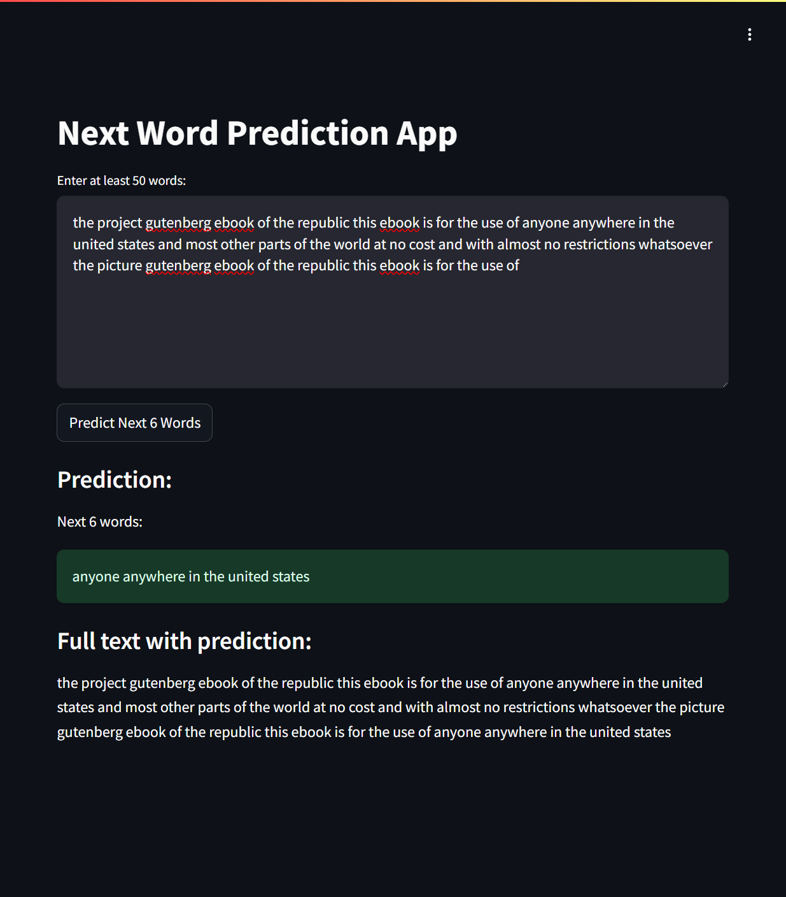

# Next Word Prediction



## Project Overview

The Next Word Prediction project is a machine learning application that predicts the next six words based on a given input of at least 50 words. This project uses a deep learning model trained on "The Republic" by Plato to generate predictions. It provides a user-friendly web interface built with Streamlit, allowing users to input text and receive instant predictions for the next six words.

The predictor is based on the text of "The Republic" by Plato, which serves as the training data for the model. The full text is available [here](https://www.gutenberg.org/files/1497/1497-h/1497-h.htm).

This project demonstrates the application of natural language processing and deep learning in creating a practical tool for writers, researchers, and language enthusiasts. It serves as an excellent example of an end-to-end machine learning project, from data preprocessing and model training to deploying a web application with multiple hosting options.

## Table of Contents

1. [Dataset](#dataset)
2. [Model Training](#model-training)
3. [Streamlit Application](#streamlit-application)
4. [Deployment Options](#deployment-options)
5. [File Structure](#file-structure)
6. [Usage](#usage)

## Dataset

The dataset used for this project is the full text of "The Republic" by Plato. The text was preprocessed and used to train a deep learning model for next word prediction.

## Model Training

The model training process is detailed in the `Predict_words.ipynb` notebook. This notebook covers data preprocessing, model architecture, and the implementation of the deep learning model for next word prediction.

You can train the model locally or use Google Colab for training. To use Google Colab:
1. Upload the `Predict_words.ipynb` notebook to Google Colab.
2. Upload the dataset to your Google Drive and mount it in Colab.
3. Run the notebook cells to train the model.
4. Download the trained model (`next_word_prediction_model.keras`) and tokenizer (`tokenizer.joblib`) files.

## Streamlit Application

The Streamlit application is defined in `app/app.py`. It provides a user interface for inputting text and viewing the predicted next six words.

## Deployment Options

There are several ways to deploy and use this application:

1. **Run Locally**:
   - Clone the repository:
     ```
     git clone https://github.com/pouryare/next-word-prediction.git
     cd next-word-prediction
     ```
   - Navigate to the `app` directory: `cd app`
   - Create a virtual environment: 
     ```
     python -m venv venv
     source venv/bin/activate  # On Windows use `venv\Scripts\activate`
     ```
   - Install requirements: `pip install -r requirements.txt`
   - Run the Streamlit app: `streamlit run app.py`
   - Open a web browser and go to `http://localhost:8501`

2. **Use Docker**:
   - Install [Docker](https://docs.docker.com/get-docker/) on your machine.
   - Pull the image from Docker Hub: 
     ```
     docker pull pouryare/next-word-prediction:latest
     ```
   - Run the container: 
     ```
     docker run -p 8501:8501 pouryare/next-word-prediction:latest
     ```

   Alternatively, you can build the image locally:
   - Navigate to the `app` directory
   - Build the Docker image: 
     ```
     docker build -t next-word-prediction:latest .
     ```
   - Run the container: 
     ```
     docker run -p 8501:8501 next-word-prediction:latest
     ```

3. **Deploy on Heroku**:
   - Create a Heroku account and install the [Heroku CLI](https://devcenter.heroku.com/articles/heroku-cli).
   - Login to Heroku: `heroku login`
   - Create a new Heroku app: `heroku create next-word-prediction`
   - Add the following buildpacks:
     ```
     heroku buildpacks:add --index 1 heroku/python
     heroku buildpacks:add --index 2 https://github.com/heroku/heroku-buildpack-apt
     ```
   - Ensure that `Procfile` and `setup.sh` are in the `app/` directory before deploying.
   - Deploy the app: `git push heroku main`
   - Open the app: `heroku open`

4. **Deploy on AWS EC2**:
   - Launch an EC2 instance and SSH into it.
   - Install required dependencies:
     ```
     sudo yum update -y
     sudo yum install git python3 python3-pip -y
     ```
   - Clone the repository and navigate to the app directory.
   - Install the required Python packages: `pip3 install -r requirements.txt`
   - Run the Streamlit app: `streamlit run app.py`
   - Configure security groups to allow inbound traffic on port 8501.

5. **Deploy on Google Cloud Platform**:
   - Set up a [Google Cloud account](https://cloud.google.com/) and create a new project.
   - Install the [Google Cloud SDK](https://cloud.google.com/sdk/docs/install).
   - Make sure `app.yaml` is in the `app/` directory before deploying.
   - Initialize your app: `gcloud app create`
   - Deploy the app: `gcloud app deploy`
   - Access your app: `gcloud app browse`

6. **Deploy on Microsoft Azure**:
   - Set up an [Azure account](https://azure.microsoft.com/).
   - Install the [Azure CLI](https://docs.microsoft.com/en-us/cli/azure/install-azure-cli).
   - Create a resource group and app service plan.
   - Create a web app: `az webapp create --resource-group myResourceGroup --plan myAppServicePlan --name next-word-prediction --runtime "PYTHON|3.7"`
   - Configure GitHub deployment: `az webapp deployment source config --name next-word-prediction --resource-group myResourceGroup --repo-url https://github.com/pouryare/next-word-prediction.git --branch main --manual-integration`

## File Structure
```
next-word-prediction/
├── app/
│   ├── app.py
│   ├── Dockerfile
│   ├── next_word_prediction_model.keras  # Note: Not included in the repository
│   ├── requirements.txt
│   ├── tokenizer.joblib
│   ├── Procfile
│   ├── app.yaml
│   ├── setup.sh
│   └── setup.py
├── Predict_words.ipynb
├── README.md
└── screenshot.png
```

**Note:** The `next_word_prediction_model.keras` file is not included in the GitHub repository due to file size limitations. You will need to train the model using the `Predict_words.ipynb` notebook.

## Usage

1. First, ensure you have the `next_word_prediction_model.keras` file:
   - Train the model locally or on Google Colab using the `Predict_words.ipynb` notebook, or
   - Download the pre-trained model from [insert alternative download link here if available]
2. Place the `next_word_prediction_model.keras` file in the `app/` directory.
3. Open the application (either locally or on a deployed platform).
4. Enter at least 50 words in the input field provided.
5. Click the "Predict Next 6 Words" button to view the predicted next six words.

---

This project demonstrates the application of deep learning in creating a next word prediction tool with a web application interface. It serves as an excellent example of an end-to-end machine learning project with practical applications in writing assistance and language modeling.

For any issues or suggestions, please open an issue on the [GitHub repository](https://github.com/pouryare/next-word-prediction).